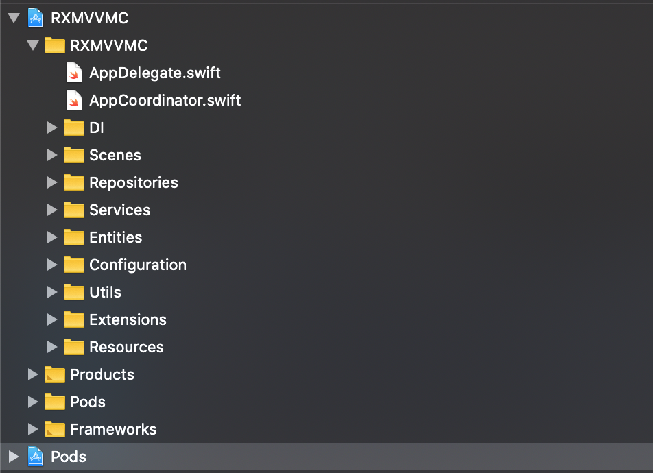
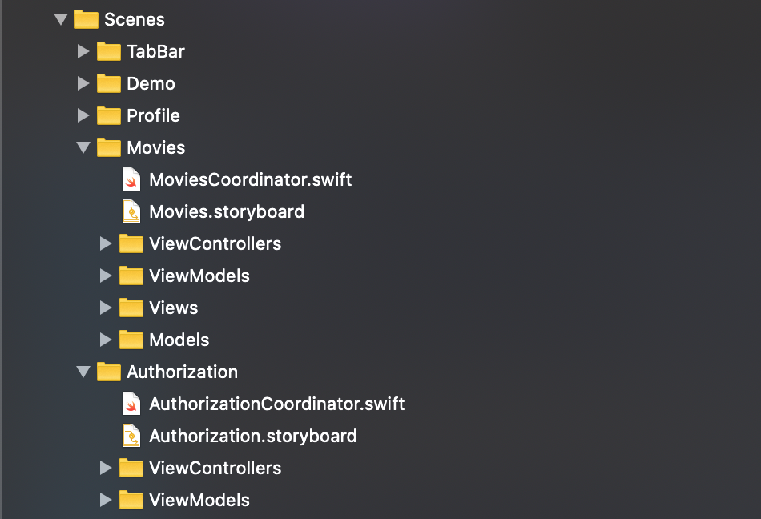
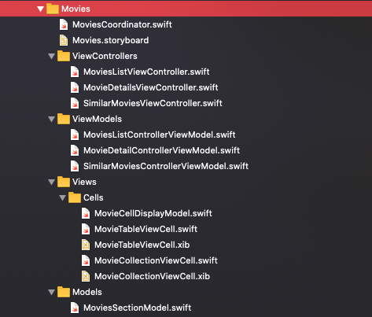
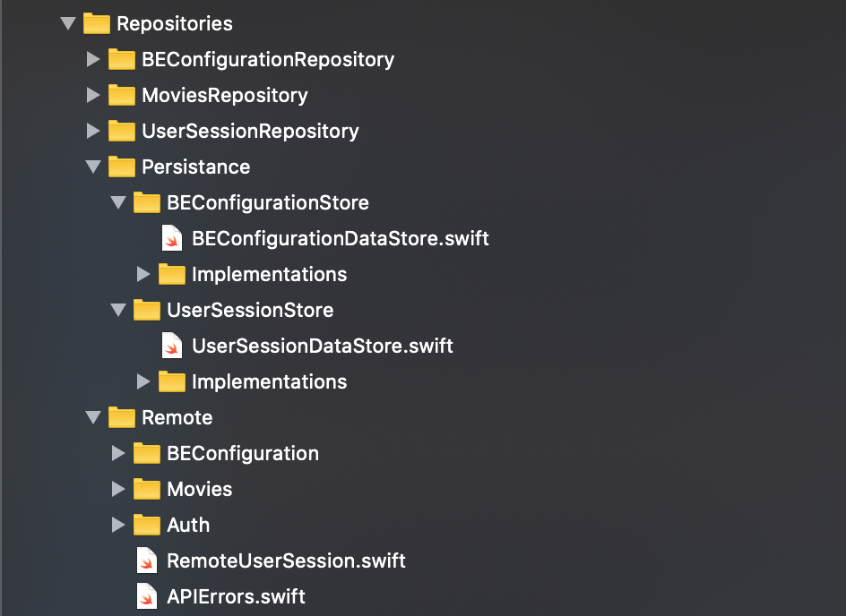
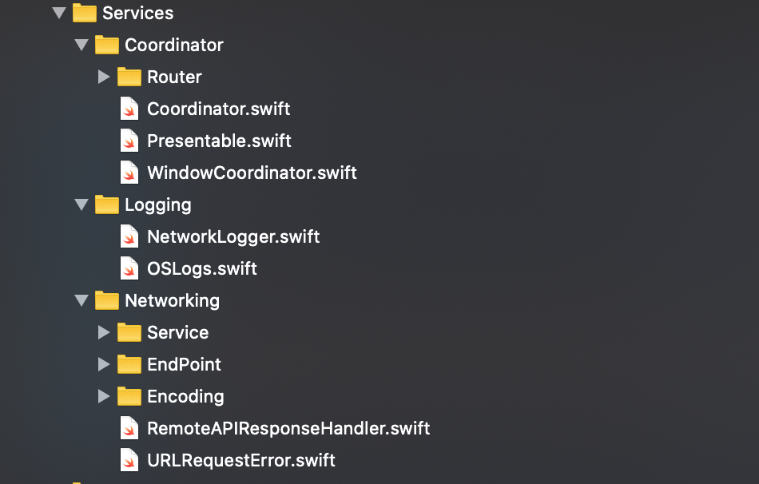
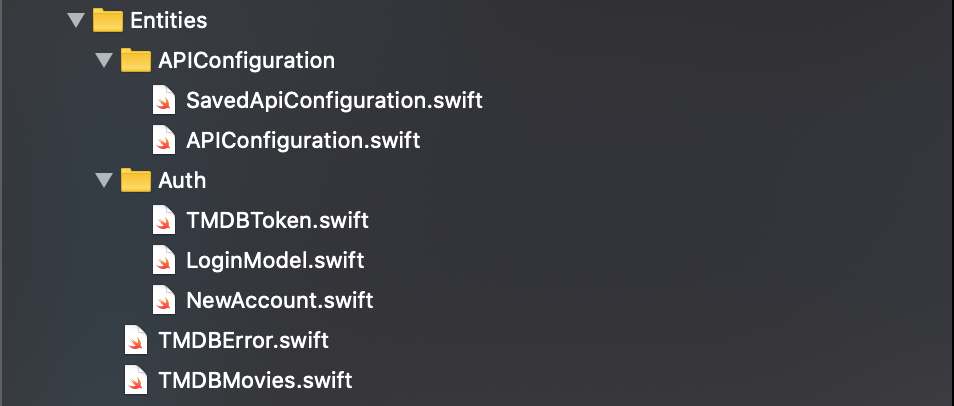
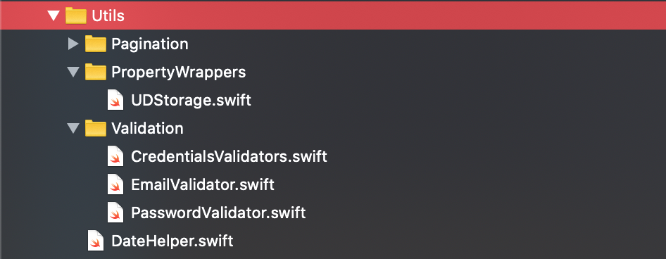
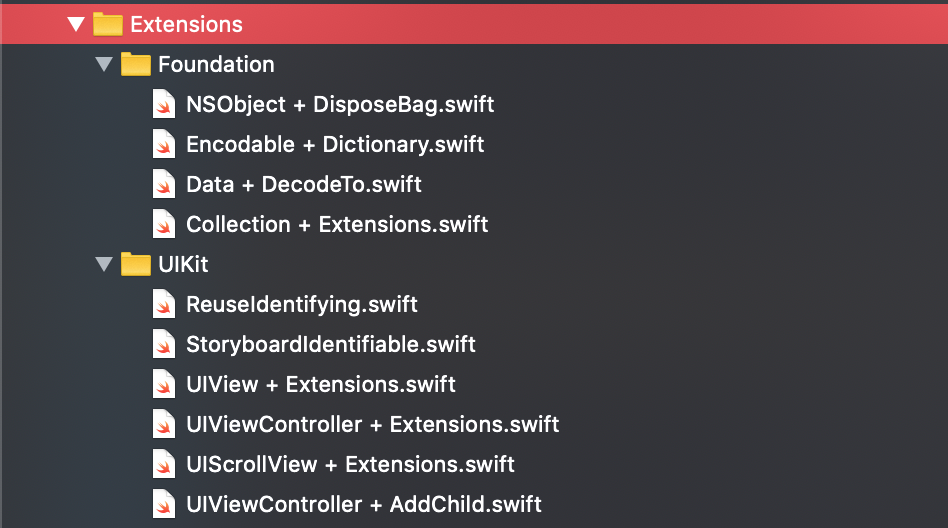
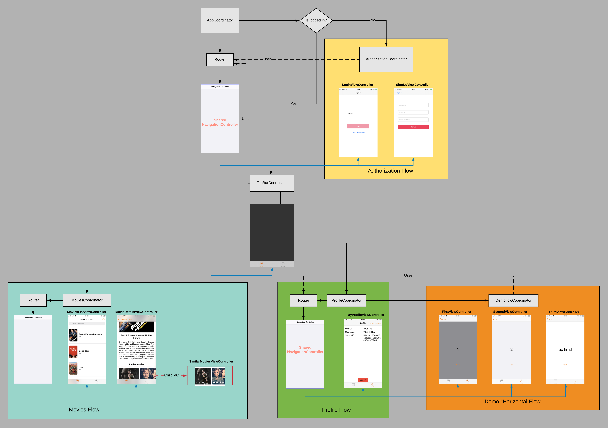
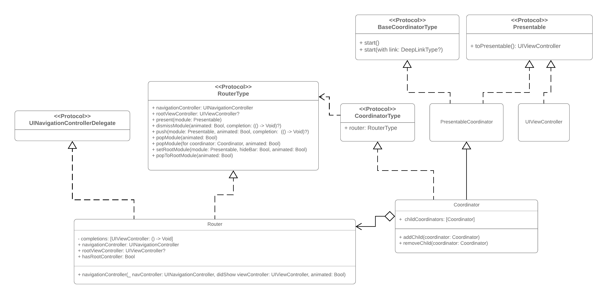

# Project structure
Project structure generally looks like

DI folder contains the Dependency Injection containers (more on DI later):

Scenes folder contains all scenes that make up the application. The scene is usually a collection of 1 to 4 screens that are meant to achieve a single purpose. For example a login flow, movies-related screens, etc.

Each scene is grouped into its own folder. This folder generally contains the scene coordinator, storyboard, view controllers, view models. Also, optionally, it can contain views that related to some of the screens presented in this scene, and models that used only by the ViewModels or ViewControllers in this scene.

The repositories folder contains objects that provide us with data either from the local storage or the remote server.

Services folder contains service objects which provides us with some set of software functionalities (such as the retrieval of specified information or the execution of a set of operations).

Entities folder contains entities and codable models.

Configuration folder contains all configuration files like .plist, .entitlements etc. AppSettings struct is also here.

Utils folder contains useful utility classes or helpers which contains a bunch of related methods, so they can be reused across the application.

Extensions folder -> Contains extension files

Resources folder generally contains assets, images, files etc.

# Project navigation

# Main patterns and abstractions

## Repository

**A repository is just an object that encapsulates all the code to query your models in one place, so you have a single-point of entry. Using this pattern can help achieve loose coupling and can keep domain objects [persistence ignorant](https://deviq.com/persistence-ignorance/) It also allows us to abstract the data source of the models (either they fetched from the remote server or the local storage).**

### WHY
If you need to query your model objects from different locations in your code over and over again, a repository can be really helpful to provide a single-entry point to work with your models and remove duplicate query code. You can take it even further and use it with protocols, this way you can easily switch out implementations (for example for unit tests).

https://medium.com/tiendeo-tech/ios-repository-pattern-in-swift-85a8c62bf436 

## DataStore
**Data stores take care of the CRUD (Create, Read, Update, Delete) operations. They abstract away the underlying data storage mechanism you want to use. They can implement CoreData, UserDefaults, Realm or even remote data store network logic. The interface into a data store exposes nothing about the underlying implementation.**
### WHY
 - Deferability: Having the ability to defer big decision such as selecting a database technology.
 - Substitutability: The ability to substitute the underlying data storage technology if needed. For example - from UserDefaults to CoreData.

## Dependency injection
The basic idea of the pattern is to provide all dependencies outside the object-under- construction. 
Instead of a client specifying which service it will use, something tells the client what service to use.
### WHY
These are the qualities that you can expect to see when putting dependency techniques into practic:

- **Maintainability:** The ability to reimplement part of a code-base without adversely affecting the rest of the code-base.

- **Testability:** Deterministic unit and UI tests, i.e., tests that don’t rely on things you can’t control, such as the network.

- **Substitutability:** The ability to substitute the implementation of a dependency at compile-time and at runtime. This is useful for A/B testing, for gating features using feature flags, for replacing side-effect implementations with fake implementations during a test, for temporarily swapping in a diagnostic version of an object during development and more.

- **Deferability**: Having the ability to defer big decisions such as selecting a database technology or networking service implementation.

- **Control during development**: A code-base that developers can quickly iterate on by controlling build and run behavior, e.g., switching from a keychain-based credential store to a fake in-memory credential store so that you don’t need to sign in and out over and over again while working on a sign-in screen.

### Dependency Injection Containers
DI Container is a software library that that provides DI functionality and allows automating many of the tasks involved in Object Composition, Interception, and Lifetime Management. DI Containers are also known as Inversion of Control (IoC) Containers. 
At the very least, a DI Container allows Auto-Wiring, which is the ability to automatically compose an object graph from maps between Abstractions and concrete types by making use of the types' metadata supplied by the compiler and the Common Language Runtime.

The current demo-project uses [Swinject](https://github.com/Swinject/Swinject) light-weight DI framework which provides us the DI Container to register and resolve the dependencies.

https://en.wikipedia.org/wiki/Dependency_injection

[iOS Dependency Injection Using Swinject](https://medium.com/flawless-app-stories/ios-dependency-injection-using-swinject-9c4ceff99e41)

## Coordinator
### Implementation details
First of all - there is no single canonical implementation of the Coordinator pattern, but the one that we used in the demo project has several benefits (we use  a slightly modified version of the [Coordinator Kit's implementation](https://github.com/imaccallum/CoordinatorKit))

1. Makes it easy to handle the "biggest pain" of the coordinator pattern - handling of the back button (or swipe back) in the horizontal flow in order to be able to deallocate the child coordinator when it finishes its flow. [**More on this problem**](https://hackernoon.com/coordinators-routers-and-back-buttons-c58b021b32a)

2. Avoids polluting navigation (router) with flow logic (coordinators)

3. Delegates what to do when the back button is pressed (deallocation of child coordinator) back to the parent coordinator

4. Provides a common interface for presenting and pushing coordinators and view controllers [**Presentable** protocol]

5. Allows us to push to subsequent horizontal flows with ease.

To achieve this, this implementation adds and uses a new component: **Router**
Router is a class that wraps a UINavigationController and you pass it around between coordinators. It handles the physical navigation whereas the coordinator handles flow logic. There is one router for each horizontal flow and it may be shared by child coordinators for horizontal flows via dependency injection. Every time you have a new vertical flow (usually modally presenting a flow) this will require instantiating a new router.

