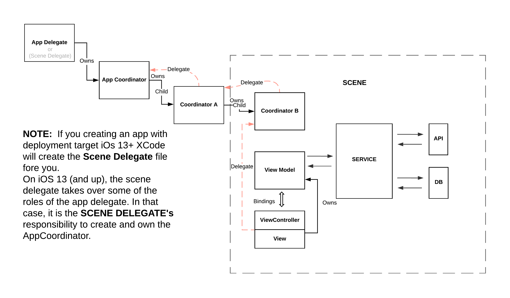
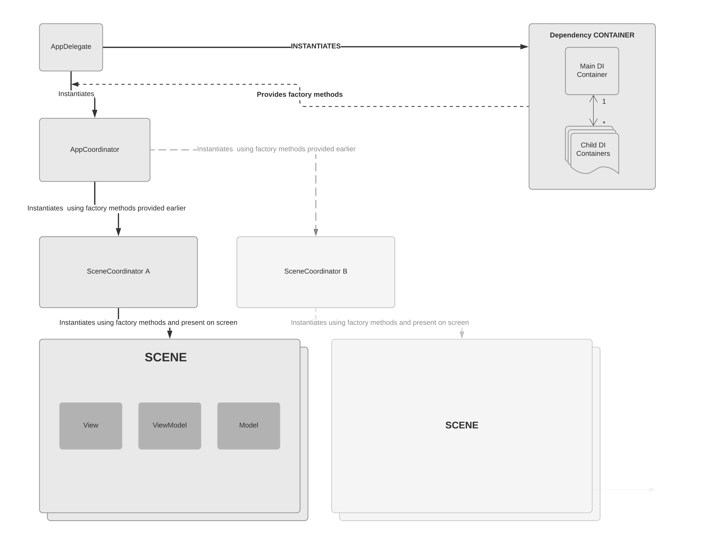

# MVVM-C with Rx-bindings
> "And here it is. Reactive programming. It should be said that RxSwift is not very popular in iOS development. While Android app just can’t be implemented without RxJava, we (iOSers) still doubt should we try this lib. “This is a third party” and “Too complicated, magic in your code” became really popular arguments against RxSwift. And now Apple is announcing a reactive framework, just meaning “Yes, guys. This is the future of iOS development. Now it’s official. Deal with it” Obviously, now many more developers will change delegates to Rx. And if they aren’t… they should be."

> -**Anton Nazarov** (https://medium.com/flawless-app-stories/will-combine-kill-rxswift-64780a150d89)


## What is MVVM

	MVVM stands for Model–View–ViewModel is a set of architectural ideas and principles.
	It aims to solve the problem of having the transformation of model objects and service interactions happen inside view controllers and reduce the complexity of the VC by taking some of its responsibilities.
	The idea of MVVM is very simple.
	We add a new layer to the MVC, between views and view controllers, which handles data transformation and service interactions.
	ViewModel keeps the view state and exposes some mechanism for providing updates. For example - this can be achieved through using RX observables 

When used propery, MVVM allows for improvements over classic MVC:

- View controllers tend to be a lot simpler and really deserve their name because their only responsibility is to "control" the view. 

- The ViewModel follows a clear Input -> Output pattern and is easy to test as they provide predefined input and testing for the expected output.

- Also it’s easy to test different data states of the View by creating mock data for the view model.

## What Coordinator is?

[**MORE ON SCENE DELEGATE**](https://learnappmaking.com/scene-delegate-app-delegate-xcode-11-ios-13/)

A coordinator is an object which has the sole responsibility, as its name implies, to coordinate the App’s navigation. Basically which screen should be shown, what screen should be shown next, etc.
	This basically means that the coordinator has to:
- Instantiate ViewController’s & ViewModel’s injecting some properties if needed
- Present or push ViewController’s onto the screen

**Why use a coordinator?**

Coordinators are a great tool because they free our ViewController’s from a responsibility that they should not have. This helps us adhere to the single responsibility principle, which makes our ViewController’s much leaner and easier to re-use.

A ViewController should not know what ViewController came before it, which one should come next, or what dependencies it should pass on. It should just be a “dumb” wrapper around the View/Subviews on the screen and handle only UIKit related stuff. Any action regarding navigation on the ViewController should be sent up to the Coordinator for proper handling.

The App should consist of multiple coordinators, one for each scene. But it should always have one “main” AppCoordinator, which will be owned by the App Delegate.

Another important part of the coordinator is the delegate callbacks we are going to be getting from the ViewControllers and other child coordinators.

<https://www.hackingwithswift.com/articles/71/how-to-use-the-coordinator-pattern-in-ios-apps>

<http://khanlou.com/2015/01/the-coordinator/>

## WHY Rx-MVVM-C
MVVM comes quite handy as it provides a loosely coupled mechanism between all components segregating your view, business and data logic.

Separating the view model from the user interface makes it easier to test presentation logic.

Separating the view controller from the presentation logic makes it easier to test the user interface.

The coordinator in its turn simplifies the app navigation and makes it **A LOT** easier to change.

MVVM works especially well with RxSwift/RxCocoa because being able to **bind** observables to UI components is a key enabler for that pattern.


# MINDSHIFT
## Declarative programming paradigm. 
Declarative programming is a programming paradigm in which the programmer defines what needs to be accomplished by the program without defining how it needs to be implemented. In other words, the approach focuses on what needs to be achieved instead of instructing how to achieve it.

<https://www.techopedia.com/definition/18763/declarative-programming>
## IMPERATIVE VS DECLARATIVE

In imperative programming, you change state at will. In functional code, you don’t cause any side effects. Since you don’t live in a perfect world, the balance lies somewhere in the middle. RxSwift combines some of the best aspects of imperative code and functional code.

Declarative code lets you define pieces of behavior, and RxSwift will run these behaviors any time there’s a relevant event and provide them an immutable, isolated data input to work with.

This way you can work with asynchronous code, but make the same assumptions as in a simple for loop: that you’re working with immutable data and you can execute code in sequential, deterministic way.

To compare these two approaches we can consider one (somewhat artificial) example:
Let's suppose that we need to request some resources form the API concurrently.

The **Imperative** realization will typically look like this -> 

```Swift
	/*
	First of all we have to declare the stored properties to hold the results of our requests.
	*/
	private var similarMoviesRequestError: Error?
	private var moviesRequestError: Error?
	private var similarMoviesPage: TMDBMoviesPage?
	private var moviesPage: TMDBMoviesPage?
	private let dataLoadingDispatchGroup = DispatchGroup()
    
	func load() {
		//Clear the previous state
		similarMoviesRequestError = nil
		moviesRequestError = nil
		similarMoviesPage = nil
		moviesPage = nil
		let dispatchGroup = dataLoadingDispatchGroup
		//For each request we must to explicitly indicate that a block has entered the group.
		dispatchGroup.enter()
		getSimilarMovies(for: 1) {[weak self] result in
		//And for each request we must to explicitly indicate that a block in the group finished executing.
			dispatchGroup.leave()
			switch result {
			case .failure(let error):
				self?.similarMoviesRequestError = error
			case .success(let page):
				self?.similarMoviesPage = page
			}
		}
		//Enter
		dispatchGroup.enter()
		getMovies(page: 1) {[weak self] result in
			//Leave
			dispatchGroup.leave()
			switch result {
			case .failure(let error):
				self?.moviesRequestError = error
			case .success(let page):
				self?.moviesPage = page
			}
		}
		//And after that we need to subscribe to the "Group finished execution" notification
		configureLoadingEnd()
    }
    
	private func configureLoadingEnd() {
		dataLoadingDispatchGroup.notify(queue: .main) {[weak self] in
			
			//Then we need to check if there was an error and respond appropriately
			guard self?.similarMoviesRequestError == nil, self?.moviesRequestError == nil else {
				//Error handling here
				return
			}
			//If there was no errors -> we can do something with responses
			guard let moviesPage = self?.moviesPage, let similarMoviesPage = self?.similarMoviesPage else { return }
			//Do something with responses here.
		}
	}
    
    
	func getSimilarMovies(for movieID: Int, completion: @escaping (Result<TMDBMoviesPage, Error>) -> Void) {
		secRouter.request(.getSimilarMovies(mediaID: movieID, apiKey: "", language: "", page: 1), responseHandler: nil) { (result: Result<TMDBMoviesPage, Error>) in
			switch result {
			case .failure(let error):
				completion(.failure(error))
			case .success(let moviesPage):
				completion(.success(moviesPage))
			}
		}
	}
    
	func getMovies(page: Int, completion: @escaping (Result<TMDBMoviesPage, Error>) -> Void) {
        router.request(.getFavoriteMovies(apiKey: "some", accountID: 1, sessionID: "", page: page), responseHandler: nil) { (result: Result<TMDBMoviesPage, Error>) in
			switch result {
			case .failure(let error):
				completion(.failure(error))
			case .success(let moviesPage):
				completion(.success(moviesPage))
			}
		}
	}

```

As we can see - there is a lot of "manual" handling. We need explicitly call  `.enter()` to tell the DispatchGroup about the block has entered the group and `.leave()` when the block finishes its execution. Also, we need to store the results of each request in the separate properties to handle them later when the group finishes the execution of both requests.

By storing results in these properties we introduce a mutable STATE, and this state can produce headaches by making it hard to understand what value a variable has and how that value changes over time. And we need to manage this state before each load call. 

Also - if wee needed to make 3 or more requests - we need to add **even more** properties (STATE) to store the results and also we will need to modify the `configureLoadingEnd()` implementation in order to take into account these new possible ERRORS and RESPONSES.

Not to mention providing RETRY ability to our requests -> It will be A LOT OF WORK, A LOT of code and A LOT of manual state manipulating.

**Declarative** approach, in other hand,  will look like this: -> 

```Swift
	let disposeBag = DisposeBag()
	//Input 
	let load = PublishSubject<Void>()

	//Output
	var responses: Observable<(TMDBMoviesPage, TMDBMoviesPage)>! //Client subscribes to it to get the responses
	var errors: Observable<Error>! //Client subscribes to it to get and show the error popup

	func getOutputs() {
		let request = load.flatMapLatest { [unowned self] in self.getBoth() }.share()
		responses = request.compactMap { $0.element } //<- Observable of responses
		errors = request.compactMap { $0.error } //<- Observable of errors
	}

	func getBoth() -> Observable<Event<(TMDBMoviesPage, TMDBMoviesPage)>> {
		//Zip operator wait until each of the inner observables emits a new value.
		Observable.zip(getFavoriteMovies(), getSimilarMovies(movieID: 1)).materialize()
	}
   
	func getSimilarMovies(movieID: Int) -> Observable<TMDBMoviesPage> {
		let rotuer = secRouter
		return Single.create { single -> Disposable in
			let task = rotuer.request(.getSimilarMovies(mediaID: movieID, apiKey: "example", language: "en", page: 1), responseHandler: nil) { (result: Result<TMDBMoviesPage, Error>) in
				switch result {
				case .failure(let error):
					single(.error(error))
				case .success(let page):
					single(.success(page))
				}
			}
			return Disposables.create {
				task?.cancel()
			}
		}.asObservable()
	}
    
	func getFavoriteMovies() -> Observable<TMDBMoviesPage> {
		let rout = router
		return Single.create { single -> Disposable in
			let task = rout.request(.getFavoriteMovies(apiKey: "example", accountID: 1, sessionID: "some", page: 1), responseHandler: nil) { (result: Result<TMDBMoviesPage, Error>) in
 				switch result {
				case .failure(let error):
					single(.error(error))
				case .success(let page):
					single(.success(page))
				}
			}
			return Disposables.create {
				task?.cancel()
			}
		}.asObservable()
	}

```
As you can see - `getBoth()` function is much more concise. There we only **DECLARE** that we need to **'zip'** (wait until each of the inner observables emits a new value) 2 requests. Then we just need to subscribe to the `responses` observable in order to get responses, and to `errors` observable to be notified about errors if any. 

As a huge bonus - we can retry one request or both on error separately with ease...

```Swift
    func getBoth() -> Observable<Event<(TMDBMoviesPage, TMDBMoviesPage)>> {
        Observable.zip(getFavoriteMovies().retry(1), getSimilarMovies(movieID: 1).retry(3))
        .materialize()
    }
```
or together

```Swift
   func getBoth() -> Observable<Event<(TMDBMoviesPage, TMDBMoviesPage)>> {
        Observable.zip(getFavoriteMovies(), getSimilarMovies(movieID: 1)).retry(1)
        .materialize()
    }
```

To perform 3 or more requests concurrently - we need just to add another one to the zip operator

```Swift
    func getBoth() -> Observable<Event<(TMDBMoviesPage, TMDBMoviesPage, TMDBMoviesPage)>>{
       Observable.zip(getFavoriteMovies(),
                      getSimilarMovies(movieID: 1),
                      getSimilarMovies(movieID: 2))
       .materialize()
    }
```

If we need to fire the second and third requests concurrently but after the first one finishes -> we can just do it like this: ->


```Swift
 typealias ThreeResponses = (TMDBMoviesPage, TMDBMoviesPage, TMDBMoviesPage)

 func getBoth() -> Observable<Event<ThreeResponses>> {
 	getFavoriteMovies().flatMapLatest {[unowned self] favoritesPage -> Observable<ThreeResponses> in
           Observable.zip(self.getSimilarMoviesObs(movieID: page.results[0].id),
                                            self.getSimilarMoviesObs(movieID: page.results[1].id))
           .map { (similarPage1, similarPage2) -> ThreeResponses in
                return (favoritesPage, similarPage1, similarPage2)
            }
        }
```
## ReactiveX
ReactiveX is a library for composing asynchronous and event-based programs by using observable sequences.

It extends the observer pattern to support sequences of data and/or events and adds operators that allow you to compose sequences together declaratively while abstracting away concerns about things like low-level threading, synchronization, thread-safety, concurrent data structures, and non-blocking I/O.

Most of the events have different interfaces: delegates, key-value observing, target action etc and ReactiveX provides a standardized interface for all these events giving us a way to react to them allowing us to focus on what to solve rather than how to solve.

KVO observing, async operations, delegation and streams are all unified under abstraction of **sequence** (often called **stream** as well).

**On top of that, you are given an amazing toolbox of functions to combine, create and filter any of those streams.** That's where the "*functional*" magic kicks in. A stream can be used as an input to another one. Even multiple streams can be used as inputs to another stream. You can merge two streams. You can filter a stream to get another one that has only those events you are interested in. You can map data values from one stream to another new one, etc.

ReactiveX raises the level of abstraction of your code so **you can focus on the interdependence of events that define the business logic, rather than having to constantly fiddle with a large amount of implementation details**. 

[2 minute introduction to Rx](https://medium.com/@andrestaltz/2-minute-introduction-to-rx-24c8ca793877)

[ReactiveX Intro](http://reactivex.io/intro.html)

[**MUST READ** explanation with examples](https://gist.github.com/staltz/868e7e9bc2a7b8c1f754)
## RxSwift / RxCocoa

**RxSwift** is a implementation of the ReactiveX in Swift.

**RxCocoa** provides Cocoa-specific capabilities for general iOS/macOS/watchOS & tvOS app development, such as Binders, Traits, and much more. Mainly used for UI bindings.

[The Basics of RxSwift in 10 Minutes](https://medium.com/ios-os-x-development/learn-and-master-%EF%B8%8F-the-basics-of-rxswift-in-10-minutes-818ea6e0a05b)

[dukhovich.by Rx Blog](http://dukhovich.by/)

[**[Very useful]** RxMarbles app](https://apps.apple.com/pl/app/rxmarbles/id1087272442)

# Responsibilities
## View
View in MVVM is a part of the **PRESENTATION layer.**
Presentation is what users can see and interact with. 

MVVM on iOS acknowledges the one-to-one relationship between views and view controllers.
Think of them as one entity that just happens to be split across a .swift file and a Storyboard.

View controllers can't talk to models directly; they only interact with view models and views.

Views only talk to the view controllers, notifying them of interaction events.

Views are responsible for only things like displaying data. It displays a representation of the model and receives the user's interaction with the view (clicks, keyboard, gestures, etc.), and it forwards the handling of these to the view model via bindings (like Rx's **bind(to: ..)**, etc.).

The ViewController will have a one-to-one relationship with the ViewModel. There will be one ViewModel per ViewController, and the ViewController will own it’s ViewModel.

 **!!!But View Controller should not create the View Model itself, it will get passed on to it via dependency injection.!!!**

## ViewModel
View models don't have any access to the user interface. Generally - you should not even import UIKit in a view model.

Typically, a view controller observes the view model know when there's new data to display.

The view model's job is to handle all presentation logic. The view model of MVVM is a value converter, meaning the view model is responsible for exposing (converting) the data objects from the model in such a way that objects are easily managed and presented. For example - if a model contains a Date, the Date formatter to format that date would live in the view model.

ViewModel may implement a mediator pattern, organizing access to the back-end logic around the set of use cases supported by the view models by talking to the services/repositories/data access objects, etc (MODEL layer).
In this respect, the view model is more model than the view, and handles most of the view's display logic. 

It’s up to you to sensibly divide and assign responsibilities across your code base. Thus, leave the View Model as the brain between your data and your screen, but make sure you split networking, navigation, cache, and similar responsibilities into other classes. 

If you do MVVM right you usually end up in a situation that the view is so simple that you don’t need to write any tests for it. All you need to do is write tests for the view model.

## MODEL
Model in MVVM and MVC means the whole Domain Model, not just one dumb model of some entity (NSManagedObject or UserProfile swift's struct for example). Domain Model can consist of one object as well as a whole system of objects. It depends on how complex business logic is.
Consider the **MODEL** as **Business Data + Business Logic + Business Rules**. 

## Coordinator
Instantiates and presents the MVVM module and coordinates the App’s navigation by interacting with its children and presented VCs via delegation pattern. 

# Module assembling
## Who creates who? 
**What is Dependency container?** [**You can find here (in the Main patterns and abstractions section)**](https://github.com/axondevgroup/chapter-mobile/blob/RxMVVM-C/Architecture/RxMVVM-C/DemoProject/README.md)

	
## Data flow


As you can see from the diagramm the data has one, and only one way to be transferred to other parts.

One-way data flow provides us with some key advantages. Like:
- Easier to debug, as we know what data is coming from where.
- Less prone to errors, as we have more control over our data.
- Defines the clear boundaries between components 

## Main rules and conventions
- **ViewModel** shold follow a clear Input -> Output pattern.
- Try to expose only **AnyObserver** from **VM** (Not Subjects). Keep subjects private at the VM. Client (the VC in our case) should not know what type of subject is used in the VM and should not depend on this information.

```Swift
//VC should know nothing about the specific type of a Subject. So we expose only "Type erasured" observers

private let subject = PublishSubject<Int>()
var exposedObserver: AnyObserver<Int> {
	subject.asObserver()
}

private let subject2 = BehaviorSubject<Int>(value: -1)
var exposedObserver2: AnyObserver<Int> {
	subject2.asObserver()
}
```

- Do not forget to dispose the subscriptions!

## Future - Apple's COMBINE + SwiftUI 
By releasing SwiftUI and Combine, Apple have put their sign of approval on Functional Reactive Programming, and soon it will no longer be a technique that only a few development teams use. We will see more and more learning resources to help people get started. 

[Will Combine kill RxSwift?](https://medium.com/flawless-app-stories/will-combine-kill-rxswift-64780a150d89)

[The Complete Guide to Combine Framework in iOS Using Swift](https://www.udemy.com/course/the-complete-guide-to-combine-framework-in-ios-using-swift/)

[SwiftUI + Combine = ❤️](https://peterfriese.dev/swift-combine-love/)

# Conclusion
**Don’t forget that MVVM itself won’t fix all of your problems. Just think about making things simple and keep in mind the design principles. You can still have a very big and complex viewModel that does a lot of things and has duplicated logic in MVVM.**

**MVC or MVVM is not a pattern. It is not a scheme of app’s modules decomposition. It is a set of architectural ideas and principles.
MVVM does not mean that there is ONLY View / ViewModel or Model  classes you can create and work with.**

**So, keep yout Presentation is loosely coupled with Domain Model, without any knowledge of Domain Model’s details and Domain Model is completely independent of Presentation, and your app’s design will be clear, reusable and maintainable.**

